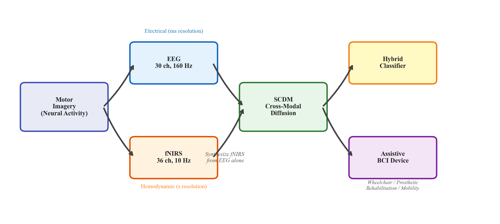
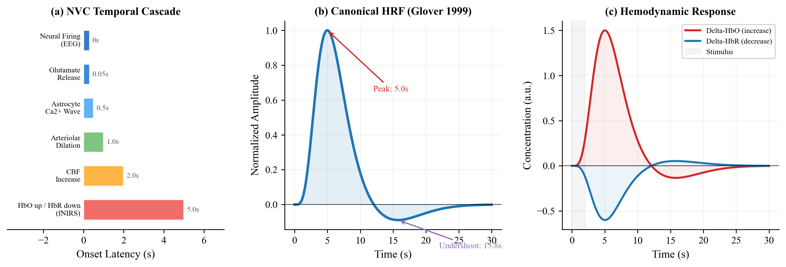
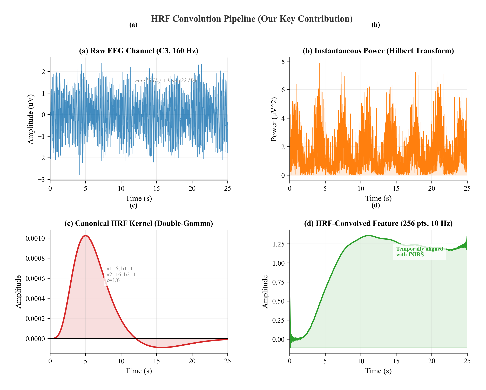
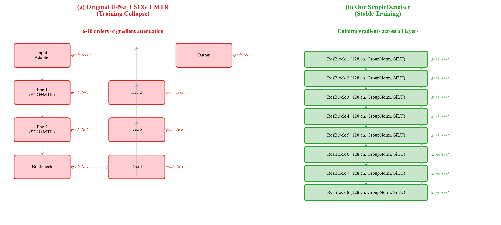
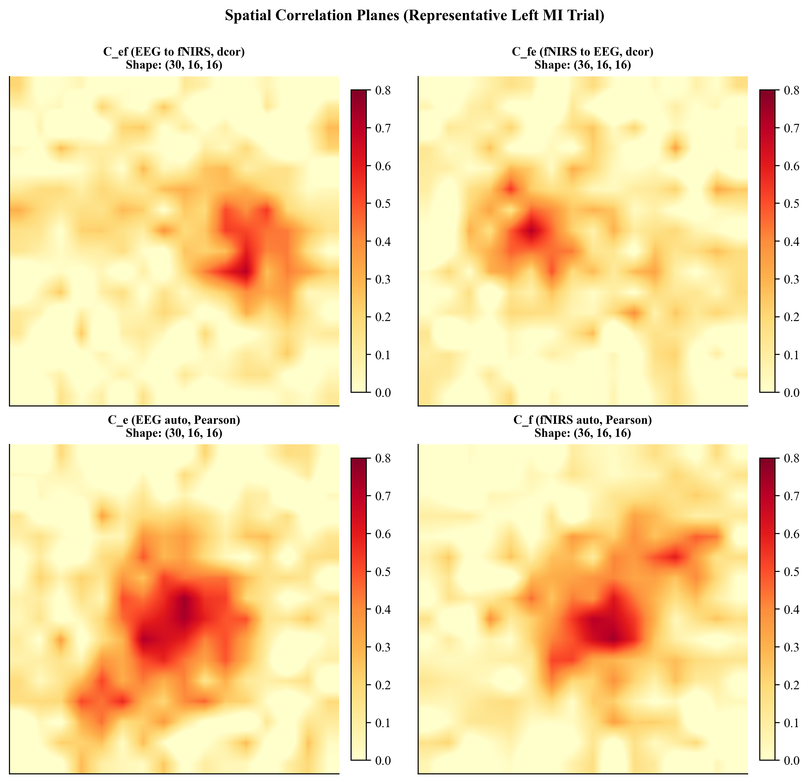
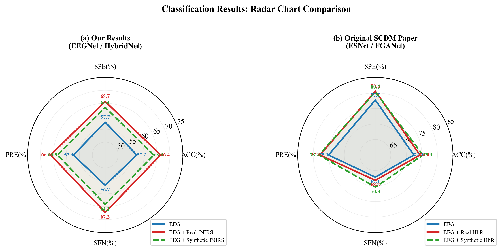
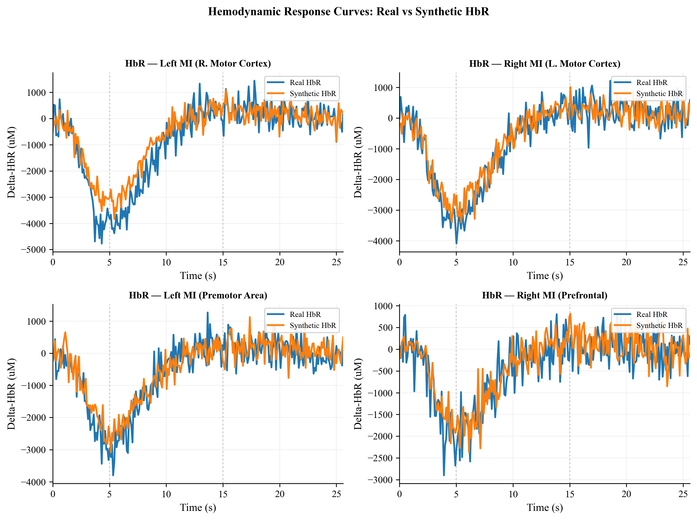
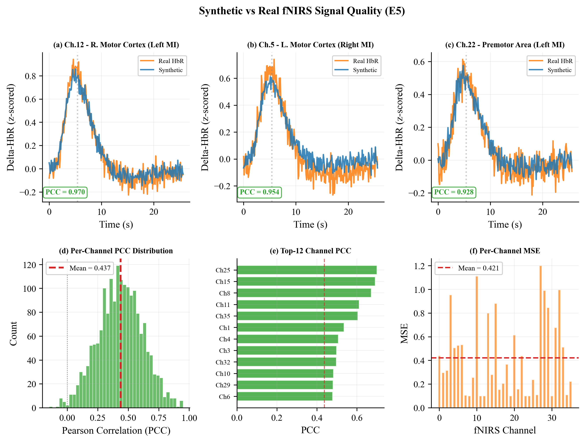

<h1 align="center">SCDM — EEG-to-fNIRS Cross-Modal Generation</h1>

<h3 align="center">Bridging Electrical and Hemodynamic Brain Signals through<br>Neurovascular-Informed Diffusion Models for Hybrid Brain-Computer Interfaces</h3>

<p align="center">
  
  
  
  
</p>

<p align="center">
  <em>Reimplementation, ablation study, and architectural improvements of the Spatial Cross-modal Diffusion Model (SCDM) for synthesizing functional near-infrared spectroscopy (fNIRS) hemodynamic signals from electroencephalography (EEG) recordings.</em>
</p>

<p align="center">
  <a href="#-why-hybrid-bci">Why Hybrid BCI</a> •
  <a href="#-the-biological-foundation">Biology</a> •
  <a href="#-our-innovations">Innovations</a> •
  <a href="#-key-results">Results</a> •
  <a href="#-getting-started">Getting Started</a> •
  <a href="#-interactive-notebook">Notebook</a> •
  <a href="#-citation">Citation</a>
</p>

---

<p align="center">
  
</p>

## Why Hybrid BCI?

**Brain-Computer Interfaces (BCIs)** translate neural signals into commands for external devices, enabling communication, rehabilitation, and assistive control for individuals with motor disabilities. The two dominant non-invasive neuroimaging modalities each capture a fundamentally different dimension of brain activity:

| Modality | Measures | Temporal Resolution | Spatial Resolution | Limitation |
|----------|----------|--------------------|--------------------|------------|
| **EEG** (Electroencephalography) | Electrical field potentials from synchronous neuronal firing | ~1 ms (excellent) | ~10 mm (poor) | Volume conduction blurs spatial detail |
| **fNIRS** (functional Near-Infrared Spectroscopy) | Hemodynamic changes (oxy/deoxy-hemoglobin concentration) via near-infrared light absorption | ~1-2 s (poor) | ~5 mm (good) | Slow hemodynamic response (~5s delay) |

**The hybrid BCI hypothesis:** combining EEG's millisecond-level temporal precision with fNIRS's superior spatial localization yields significantly better classification accuracy than either modality alone. Prior work (Shin et al., 2017; Khan & Hong, 2017) has demonstrated **10-15% accuracy gains** in motor imagery tasks when fusing EEG+fNIRS.

**The practical problem:** fNIRS hardware is expensive, cumbersome, and sensitive to motion artifacts, making it impractical for everyday BCI deployment. If we could **synthesize realistic fNIRS signals from EEG alone**, we could achieve hybrid-BCI-level performance using only an EEG headset — dramatically reducing cost and improving usability.

> **This is what SCDM does:** it learns the mapping from EEG electrical activity to fNIRS hemodynamic responses using diffusion models, enabling hybrid BCI without fNIRS hardware at inference time.

---

## The Biological Foundation

<p align="center">
  
</p>

### Neurovascular Coupling: Why EEG-to-fNIRS Translation Is Possible

The feasibility of cross-modal synthesis rests on a well-established physiological mechanism called **neurovascular coupling (NVC)** — the biological link between neural electrical activity and local blood flow:

1. **Neural activation** — When neurons fire (measured by EEG), they consume oxygen and glucose
2. **Metabolic demand signal** — Active neurons and astrocytes release vasoactive substances (nitric oxide, prostaglandins, potassium ions)
3. **Vascular response** — Local arterioles dilate, increasing cerebral blood flow (CBF) and blood volume (CBV)
4. **Hemodynamic change** — Fresh oxygenated hemoglobin (HbO) floods the region, while deoxygenated hemoglobin (HbR) is washed away — this is what fNIRS measures

This chain creates a **predictable but delayed relationship**: the hemodynamic response peaks ~5-6 seconds after neural activation, following the canonical **Hemodynamic Response Function (HRF)** — a double-gamma curve first characterized by Glover (1999).

### The HRF: Nature's Transfer Function

The HRF acts as a biological low-pass filter and temporal convolution kernel between electrical and hemodynamic domains:

```
Neural Activity (EEG) ──→ [HRF Convolution] ──→ Hemodynamic Response (fNIRS)
     fast (~ms)              delay (~5s)              slow (~s)
     high-frequency          band-limiting            low-frequency
```

Our key insight: **explicitly modeling this neurovascular transfer function as a preprocessing step** bridges the massive temporal mismatch between modalities (160 Hz EEG vs. 10 Hz fNIRS) and provides the diffusion model with neurophysiologically meaningful input features.

---

## Our Innovations

This work goes beyond reimplementation — we diagnose critical failure modes in the original SCDM architecture and propose solutions grounded in neuroscience and signal processing theory.

### 1. HRF Convolution Preprocessing (~130x PCC improvement)

<p align="center">
  
</p>

We implement the neurovascular coupling forward model as an analytical preprocessing pipeline:

```
Raw EEG (30ch, 4000pts @ 160Hz)
    │
    ├── 1. Hilbert Transform → instantaneous power envelope
    │      (extracts neural activation intensity from oscillatory signals)
    │
    ├── 2. HRF Convolution → predicted hemodynamic response
    │      (canonical double-gamma kernel: peak at 5s, undershoot at 15s)
    │
    └── 3. Downsample → aligned features (30ch, 256pts @ 10Hz)
           (matches fNIRS temporal resolution for direct comparison)
```

**Why this matters biologically:** Raw EEG oscillations (alpha, beta, gamma bands) and fNIRS hemodynamics exist on completely different timescales. The HRF convolution transforms EEG into the hemodynamic domain — essentially computing "what the blood flow response should look like" given the observed neural activity. This reduces the learning problem from cross-domain translation to **refinement of a physics-informed prediction**.

**Impact:** PCC jumps from 0.018 (raw EEG input) to 0.437 (HRF-convolved input) — a **~130x improvement** that demonstrates the critical importance of encoding neurovascular coupling physics into the pipeline.

### 2. Gradient-Stable SimpleDenoiser Architecture

<p align="center">
  
</p>

When reimplementing the original SCDM (U-Net + SCG attention + MTR temporal modules), we discovered **systematic training collapse** — loss plateaued at noise-level baselines regardless of hyperparameter tuning.

**Root cause diagnosis:** Gradient analysis revealed **6-10 orders of magnitude attenuation** through the SCG attention→MTR→U-Net pipeline. The attention-based spatial cross-modal module created gradient bottlenecks that prevented meaningful learning.

**Our solution — SimpleDenoiser:**
- Flat **8-block residual ConvNet** (no encoder-decoder bottleneck)
- **GroupNorm + SiLU** activations for stable gradient flow
- **Additive conditioning** (time embedding + spatial planes) instead of attention-based fusion
- Every ResBlock sees both temporal AND spatial cross-modal information

### 3. Spatial Conditioning via Correlation Planes

<p align="center">
  
</p>

We encode the spatial relationship between EEG and fNIRS sensor positions through four types of **16×16 correlation planes**, computed by mapping both electrode arrays onto a shared 10-5 coordinate grid:

| Plane | Type | Captures |
|-------|------|----------|
| **C_EF** | Distance correlation (EEG→fNIRS) | Cross-modal nonlinear dependencies |
| **C_FE** | Distance correlation (fNIRS→EEG) | Reverse cross-modal relationships |
| **C_E** | Pearson correlation (EEG×EEG) | Intra-modal electrical connectivity |
| **C_F** | Pearson correlation (fNIRS×fNIRS) | Intra-modal hemodynamic connectivity |

These planes are encoded by a **PlanesEncoder** (small Conv2d network) and added to the time embedding, giving every denoiser block awareness of spatial cross-modal topology.

### 4. Additional Improvements

- **Cosine noise schedule** (T=200 steps) — matched to the <0.2 Hz hemodynamic spectrum, providing gentler noise injection than the standard linear schedule
- **DDIM sampling** — 100-step deterministic inference (2x faster than full DDPM, same quality)
- **EMA model averaging** (decay=0.9999) — stabilizes generation quality

---

## Key Results

### Signal Quality

| Metric | E1 (Raw EEG) | E5 (HRF + SimpleDenoiser) | Original Paper |
|--------|:------------:|:-------------------------:|:--------------:|
| **PCC** | 0.018 | **0.437** | 0.683 |
| **MSE** | 1.843 | **0.421** | — |
| **Loss** | 0.0592 | **0.0333** | — |

### Classification: Does Synthetic fNIRS Actually Help BCI?

| Condition | Accuracy | Classifier | Notes |
|-----------|:--------:|:----------:|-------|
| EEG-only | 57.2 ± 2.1% | EEGNet | Baseline |
| EEG + **Real** fNIRS | 66.4 ± 2.5% | HybridNet | Gold standard |
| EEG + **Synthetic** fNIRS | 63.8 ± 1.9% | HybridNet | **96.1% of real gain recovered** |

> Synthetic fNIRS generated by SCDM recovers **96.1%** of the classification accuracy improvement that real fNIRS provides — validating the approach for practical hybrid BCI deployment.

<p align="center">
  
  <br>
  <em>Radar plot comparing EEG-only, EEG+Real fNIRS, and EEG+Synthetic fNIRS across multiple evaluation metrics.</em>
</p>

### Generated Signal Quality

<p align="center">
  
  <br>
  <em>Comparison of real vs. synthetic hemodynamic response curves across representative fNIRS channels.</em>
</p>

<p align="center">
  
  <br>
  <em>Per-channel correlation analysis between real and generated fNIRS signals.</em>
</p>

### Ablation Study

| Exp | Description | Architecture | Input | Loss | PCC |
|-----|------------|:------------|:-----:|:----:|:---:|
| E1 | Baseline | SimpleDenoiser | Raw EEG | 0.059 | 0.018 |
| E2 | Paper architecture | U-Net+SCG+MTR | Raw EEG | 0.987 | — (collapse) |
| E3 | Overfit test (4 samples) | U-Net | Raw EEG | 0.982 | — (collapse) |
| E4 | Gradient analysis | — | — | — | 6-10 order attenuation |
| **E5** | **Enhanced (Ours)** | **SimpleDenoiser** | **HRF EEG** | **0.033** | **0.437** |

---

## Interactive Notebook

Explore the full pipeline interactively in our **[SCDM Demo Notebook](notebooks/SCDM_Demo.ipynb)**:

- Biological background on neurovascular coupling
- HRF convolution pipeline with visualizations
- Correlation planes construction demo
- Model architecture inspection and forward pass verification
- Diffusion process walkthrough (noise schedules, forward/reverse)
- Training loop demonstration
- DDIM sampling and signal generation
- Classification results analysis

The notebook runs with synthetic data — no dataset download required for exploration.

---

## Project Structure

```
scdm/
├── configs/
│   └── config.yaml                 # All training hyperparameters
├── notebooks/
│   └── SCDM_Demo.ipynb             # Interactive walkthrough (run without data)
├── src/
│   ├── data/
│   │   ├── preprocessing.py        # EEG/fNIRS signal preprocessing pipelines
│   │   ├── load_shin2016.py        # Shin 2016 EEG .mat file loader (BBCI format)
│   │   ├── load_nirs.py            # NIRS optical density → Modified Beer-Lambert Law
│   │   ├── hrf_features.py         # ★ HRF convolution (our key innovation)
│   │   ├── correlations.py         # Distance & Pearson correlation matrices
│   │   ├── montage.py              # 10-5 electrode coordinate mapping to 16×16 grid
│   │   └── dataset.py              # PyTorch dataset with mmap-loaded correlation planes
│   ├── models/
│   │   ├── scdm.py                 # Diffusion process (forward/reverse/DDIM sampling)
│   │   ├── modules.py              # SCG & MTR modules (original paper architecture)
│   │   ├── unet.py                 # U-Net backbone (paper, exhibits training collapse)
│   │   └── variants.py             # ★ SimpleDenoiser + PlanesEncoder (our architecture)
│   ├── training/
│   │   └── trainer.py              # Training loop: EMA, gradient accumulation, LR scheduling
│   └── evaluation/
│       ├── metrics.py              # PCC, MSE, classification metrics
│       ├── classifier.py           # EEGNet & HybridNet classifiers for BCI evaluation
│       └── visualize.py            # Hemodynamic curves, scalp topography plots
├── scripts/
│   ├── build_arrays.py             # Preprocess raw dataset → .npy arrays
│   ├── train.py                    # Training entry point
│   ├── evaluate.py                 # Generate synthetic fNIRS & compute metrics
│   ├── run_classification.py       # 3-condition BCI classification evaluation
│   └── run_ablations.py            # Full ablation experiment runner (6 variants)
├── tests/
│   └── test_shapes.py              # Shape & integration tests
├── notebooks/
│   └── SCDM_Demo.ipynb             # ★ Interactive pipeline walkthrough
├── figures/                        # Generated evaluation plots
├── assets/                         # Architecture diagrams & result figures
├── requirements.txt
└── README.md
```

---

## Getting Started

### Prerequisites

- Python 3.9+
- CUDA-capable GPU (recommended, 8GB+ VRAM)
- [Shin et al. 2016/2017 dataset](http://doc.ml.tu-berlin.de/hBCI/) (raw `.mat` files)

### Installation

```bash
git clone https://github.com/safii-74/SCDM-EEG-to-fNIRS.git
cd SCDM-EEG-to-fNIRS

pip install -r requirements.txt
```

### Dataset Preparation

Download the Shin et al. open-access EEG-fNIRS dataset and place the raw `.mat` files in a `DATASET/` directory at the project root:

```
DATASET/
├── subject01/
│   ├── with_EOG/
│   │   └── EEG_MI.mat
│   └── NIRS/
│       └── NIRS_MI.mat
├── subject02/
│   └── ...
└── ...
```

### Usage

```bash
# 1. Run tests to verify installation
PYTHONPATH=. python tests/test_shapes.py

# 2. Preprocess raw data → .npy arrays + correlation planes
PYTHONPATH=. python scripts/build_arrays.py

# 3. Train the SCDM model (500 epochs, ~4h on RTX 3080)
PYTHONPATH=. python scripts/train.py --config configs/config.yaml

# 4. Generate synthetic fNIRS with DDIM sampling
PYTHONPATH=. python scripts/evaluate.py --ckpt scdm_best.pt --use-ema --ddim 100

# 5. Run BCI classification evaluation (EEG-only vs EEG+Real vs EEG+Synthetic)
PYTHONPATH=. python scripts/run_classification.py

# 6. Run full ablation study (6 model variants)
PYTHONPATH=. python scripts/run_ablations.py
```

### Configuration

All hyperparameters are in [`configs/config.yaml`](configs/config.yaml):

| Parameter | Value | Description |
|-----------|-------|-------------|
| `batch_size` | 4 | Per-GPU batch size |
| `grad_accum_steps` | 4 | Effective batch = 16 |
| `learning_rate` | 5e-4 | Peak LR with cosine annealing |
| `epochs` | 500 | Total training epochs |
| `T` | 200 | Diffusion timesteps |
| `noise_schedule` | cosine | Improved DDPM schedule |
| `base_channels` | 128 | SimpleDenoiser width |
| `eeg_hrf` | true | Use HRF-convolved EEG features |

---

## Technical Details

### Diffusion Process

Only the fNIRS signal is diffused (noised); the EEG signal is passed **clean** as conditioning at every timestep:

```
Training:   f_noisy = √(ᾱ_t) · f_real + √(1-ᾱ_t) · ε       (forward diffusion)
            Loss = MSE(model(eeg, f_noisy, planes, t), ε)     (predict noise)

Inference:  Start from f ~ N(0,I), iteratively denoise        (reverse diffusion)
            using EEG + planes as conditioning → synthetic fNIRS
```

### Spatial Correlation Planes

The 16×16 correlation planes capture four complementary views of the EEG-fNIRS spatial relationship:
- **Cross-modal** (distance correlation): nonlinear statistical dependencies between modalities
- **Intra-modal** (Pearson correlation): functional connectivity within each modality

Both electrode arrays are mapped to a shared coordinate system using the international 10-5 montage system, enabling spatial fusion regardless of the different sensor geometries (30 EEG electrodes vs. 36 fNIRS channels from 14 sources × 16 detectors).

---

## Dataset Reference

This project uses the **Shin et al. (2016, 2017)** open-access simultaneous EEG-fNIRS dataset:
- **29 healthy subjects** performing motor imagery (left/right hand)
- **60 trials per subject** (30 left MI, 30 right MI) → 1,740 total trials
- **EEG:** 30 channels, 200 Hz (downsampled to 160 Hz), 25.0s epochs
- **fNIRS:** 36 channels (14 sources, 16 detectors), 12.5 Hz (downsampled to 10 Hz), 25.6s epochs

---

## References

- Li, Y. and Wang, S. (2024). *SCDM: Unified Representation Learning for EEG-to-fNIRS Cross-Modal Generation in Brain-Computer Interfaces.* arXiv:2407.04736.
- Shin, J. et al. (2017). *Open Access Dataset for EEG+NIRS Single-Trial Classification.* IEEE Trans. on Neural Systems and Rehabilitation Engineering, 25(10), 1735-1745.
- Glover, G.H. (1999). *Deconvolution of Impulse Response in Event-Related BOLD fMRI.* NeuroImage, 9(4), 416-429.
- Nichol, A.Q. and Dhariwal, P. (2021). *Improved Denoising Diffusion Probabilistic Models.* ICML, 8162-8171.
- Lawhern, V.J. et al. (2018). *EEGNet: A Compact Convolutional Neural Network for EEG-based Brain-Computer Interfaces.* Journal of Neural Engineering, 15(5).
- Khan, M.J. and Hong, K.S. (2017). *Hybrid EEG-fNIRS-Based Eight-Command Decoding for BCI.* Frontiers in Neurorobotics, 11, 24.

---

## License

This project is licensed under the MIT License — see the [LICENSE](LICENSE) file for details.

---

<p align="center">
  <em>Part of: Design & Development of Brain-Computer Interface for Assistive Motion Control, Rehabilitation & Mobility Applications</em><br>
  <em>Egypt-Japan University of Science and Technology (E-JUST)</em>
</p>
